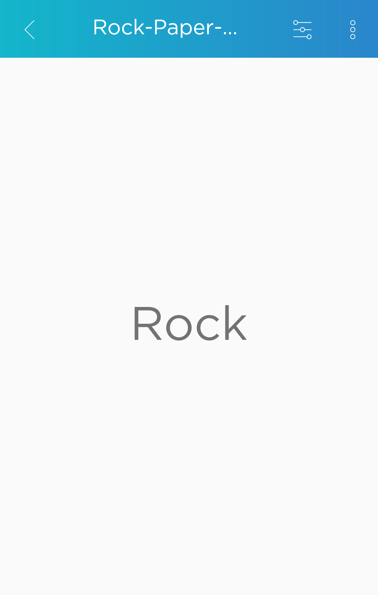
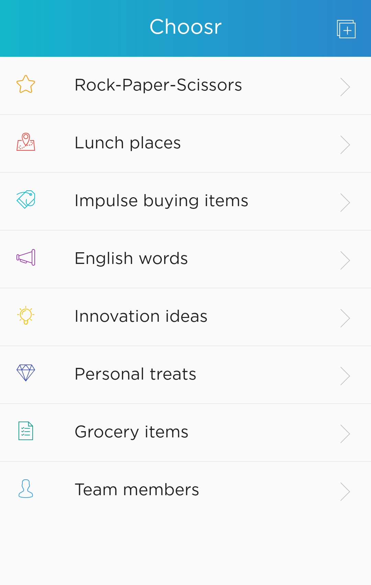
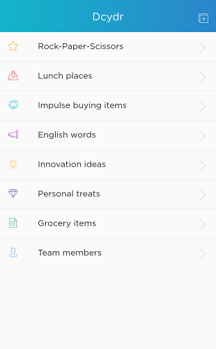
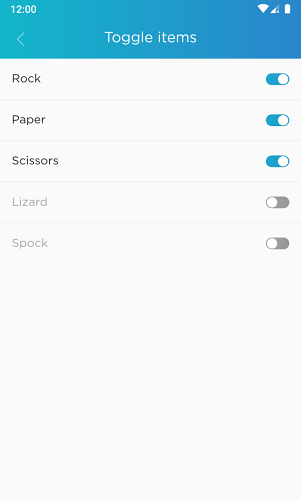

# Choosr

- Can't decide where to eat?
- Can't decide to take the bus or train?

Let Choosr help you!

Choosr helps victims of paralysis analysis by picking a random choice from a list that you customize. You can add as many as you like for every situation and choose icons to match your list. When picking for specific occasions, you can also restrict Choosr by disabling some choices. No need remove and enter them back again.

Deciding takes a lot of mental effort. So don't waste those brain power deciding on those small mundane things. Save them for your bigger decisions. For those other trivial things, let Choosr choose for you.

 

## Side Note

Just a side-project so its not perfect. It's free (as in free lunch and free speech) so don't complain.

Built with Flutter.

## Setup

`flutter pub get`

## Run

`flutter run`

## License

MIT
